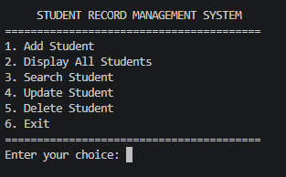
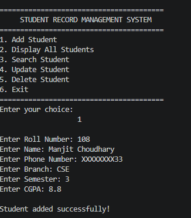
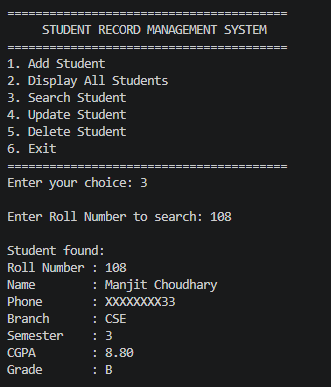
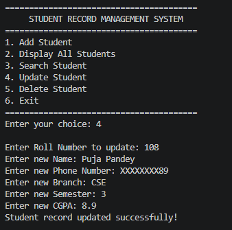
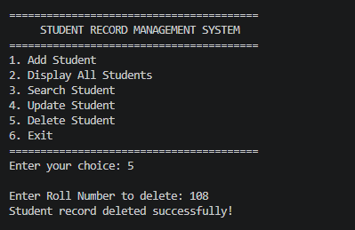

# Student Record Management System

A C++ based Student Record Management System developed using Object-Oriented Programming concepts.

## Project Description

The Student Record Management System is a console-based application developed in C++. It allows users to manage student records efficiently through a simple menu-driven interface.

The system provides functionality to add, display, search, update, and delete student records. Student information is also stored in a text file using file handling.

## Objectives

- To develop a practical application using C++.
- To implement Object-Oriented Programming concepts.
- To manage student records efficiently.
- To implement file handling for persistent data storage.
- To practice software development using Git and GitHub.

## Features

- Add a new student
- Display all student records
- Search for a student using roll number
- Update student information
- Delete a student record
- Calculate student grade based on CGPA
- Store records using file handling
- Menu-driven console interface

## Technologies Used

- C++
- Object-Oriented Programming
- STL Vector
- File Handling
- Git
- GitHub
- Visual Studio Code

## OOP Concepts Used

### Classes and Objects

The project uses classes such as `Person`, `Student`, and `StudentManager` to organize the program.

### Inheritance

The `Student` class inherits from the `Person` class.

```text
Person
   |
   ↓
Student
## Screenshots

### Main Menu



### Add Student



### Display Students


### Search Student



### Update Student



### Delete Student

